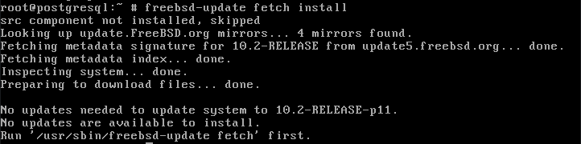
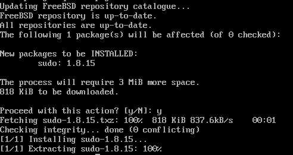

+++
date = '2016-01-27T00:00:00-05:00'
draft = false
title = '7 Things to Do After Installing FreeBSD'
+++

[](/posts/7-things-to-do-after-installing-freebsd/)

If you are unfamiliar with FreeBSD, it is an operating system for your PC, server, or embedded system that is free and open source.

In this article, I will go through a list of things to do after installing the operating system. In the process, you will learn everyday tasks in order to maintain the OS and references to learn more that this article does not cover.

## 1. Learn about FreeBSD

The FreeBSD community has done an excellent job documenting the operation system and had a very vibrant community. You can get the latest news, security advisories, etc. at [freebsd.org](http://www.freebsd.org/) or you can get a jump start by reading [The FreeBSD Handbook](http://www.freebsd.org/doc/en_US.ISO8859-1/books/handbook/).

## 2. Update your system



As in every operating system you install, you should always check for the latest updates.

Why?

The installation only provides a snapshot of the operating system on the release date. Since then there might be bug fixes, new features, or more importantly security patches.

updating the root operating system is only one command with a few parameters.

```
freebsd-update fetch install
```

Next, you want to update your install packages.

```
pkg update && pkg upgrade
```

## 3. Setup your environment

If you plan on using your installation as a desktop then you should look at this nice write-up [A FreeBSD 10 Desktop How-to](https://cooltrainer.org/a-freebsd-desktop-howto/) by Nicole Allison Reid or check out [PC-BSD](http://www.pcbsd.org/) which is FreeBSD on the back-end and has a desktop and more all ready to go.

As a server installation I like to utilize the resolution of my modern-day monitors and this is easy enough to do.

```
vidcontrol -i mode
```

This will give you a list of the available modes. Once you have selected your preferred mode type

```
vidcontrol MODE_280
```

Replaces the mode number with the one you selected. MODE_280 with changing your resolution to 1024X768 which works perfectly for me.

In order to maintain your resolution after a reboot, add your mode to _/etc/rc.conf_.

```
echo allscreens_flags="MODE_280" >> /etc/rc.conf
```

## 4. Install other software

FreeBSD has two ways to install software, ports, or packages.

Ports allow you to compile from source code. This allows you to be secure and optimize for your system. To get started with the ports collection you can use the _portsnap_ command.

```
portsnap fetch extract
```

The _fetch_ command will download a compressed snapshot of the Ports Collection and _extract_ will uncompress and dump it in _/usr/ports_ directory. Once this is done you can locate the program directory you want to install and type:

```
make install clean
```

Packages are pre-compiled binaries, so they are fast and easy to install. Usually, packages are the preferred method to install applications on your computer. For the rest of this article, we will be using the _pkg_ command to install packages. Installing packages is easy to use.

```
pkg install
```

To search for packages.

```
pkg search
```

To upgrade installed packages.

```
pkg upgrade
```

If you are running a server that has exposed services to the open web, it is a good idea to know what vulnerabilities they have. Pkg includes a built-in auditing mechanism.

```
pkg audit -F
```

For more detail refer to the [FreeBSD Handbook on Installing Applications](https://www.freebsd.org/doc/handbook/ports.html).

## 5. Setup sudo

If you are coming from the Linux or Mac world you are probably familiar with the _sudo_ command. By default, FreeBSD is stripped down and does not have _sudo_ installed.

For those unfamiliar with _sudo_ it is a program that allows a user to have elevated privileges for a command.

```
pkg install sudo
```



Now open _/usr/local/etc/sudoers_ as root in your favorite text editor and uncomment the line:

```
%wheel ALL=(ALL) ALL
```

This will give everyone in the wheel group access to \*sudo\*.

## 6. Setup your shell

Whether you are setting up a laptop or a server you will most likely be using a terminal at some point. I prefer ZSH combined with [oh-my-zsh](http://ohmyz.sh/) framework at the moment.

```
sudo pkg install zsh git curl
```

Now assign the shell to your account.

```
chsh -s /usr/local/bin/zsh
```

7. Stay current

---

Now that you are all set up and ready to go with your new FreeBSD install it is god to keep up to date on the current FreeBSD news. Below I will list a few good sources to keep yourself current.

- **[BSD Now](http://www.bsdnow.tv/)** - Kris Moore (Founder of PC-BSD) and Allan Jude (FreeBSD Contributor) host a weekly podcast covering the news on all BSDs.

- **[BSD Magazine](http://bsdmag.org)** - A monthly publication for beginners and professionals that requires free membership to download a PDF or epub.

- **[FreeBSD Journal](https://www.freebsdfoundation.org/journal)** - Another magazine put together by [FreeBSD Foundation](https://www.freebsdfoundation.org/). No free buy well worth the money in order to support the community.

- **[FreeBSD News](https://www.freebsdnews.com/)** - FreeBSD News

- **[DragonFly Digest](http://www.dragonflydigest.com/)** - Focuses on DragonFly BSD mainly but has other BSD section every Saturday.
